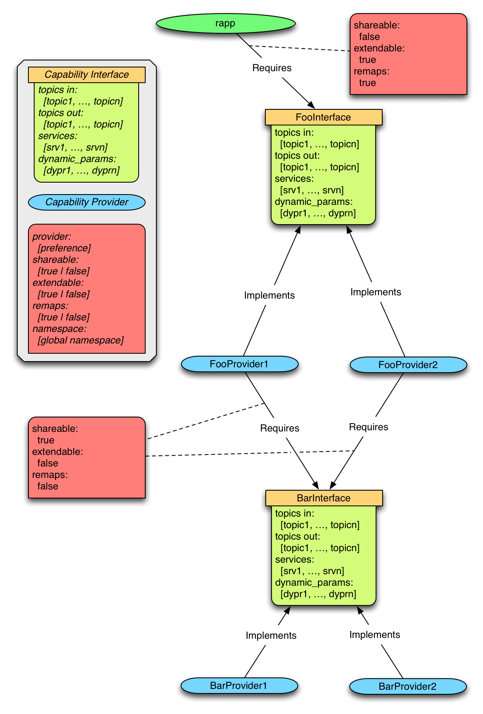
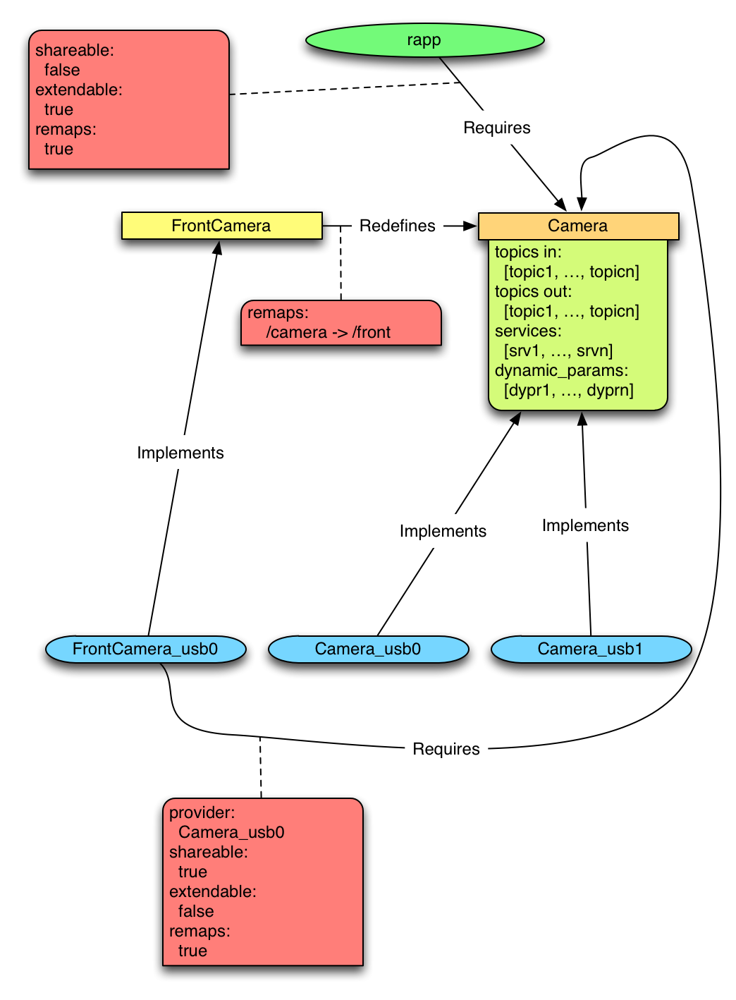

Design of Capabilities
======================

Capabilities are intended to be a higher level interface on top of ROS constructs like topics, services, and dynamic parameters, which are setup and tuned on a per robot basis by the robot developer. These capabilities are a common interface which can be used by both robot developers and robotic app developers to agree upon the ROS interface for a given "capability" required by the application and provided by the robot.

The goal of these higher level interfaces is to make applications and solutions which build upon them more portable.

.. contents::

Conceptual Overview
===================

The conceptual overview of capabilities and their related topics should be covered before detailing the design and implementation of Capabilities.

Terminology
-----------

Robot Developers
^^^^^^^^^^^^^^^^

`Robot Developers`_ are the developers who are responsible for setting up software for a particular model or configuration of a robot. Many pieces of software which need to be wrapped up and provided in a consistent way require robot specific tuning. This could be anything like addresses of hardware, robot models, or robot specific parameters a navigation stack. The `Robot Developers`_ is responsible for tuning and organizing these software stacks into discrete "capabilities" which can be advertised to any robot agnostic applications.

App Developers
^^^^^^^^^^^^^^

`App Developers`_ are the developers of robotics related applications. These developers differ from `Robot Developers`_ in that they write applications which are robot agnostic. The apps can depend on "capabilities" provided by robots to perform some task.

Rapps
^^^^^

*Robot Applications* or Rapps_ are applications which are robot agnostic, but in this context are distinctly different from Android Applications. **??** should there be a distinction, or should a rapp be any app (or software) which utilizes the capabilities in a robot agnostic fashion?

Rapps_ can require particular "capabilities" which should be provided by a robot in order for the Rapp to be compatible with the robot. The Rapps_ can also programatically query the "capabilities" and add conditions to the require. The conditions might include preferred implementations of the capabilities, whether sharing the capabilities is allowed, and if implementations of similar capabilities should be allowed or considered.

Capabilities
^^^^^^^^^^^^

Capabilities_, also known as Capability Interfaces, are interfaces consisting of many elements which are used by both robot developers and robotic app developers. Capability Interfaces consist of these elements:

- **name**: Name of the Capability Interface, e.g. *RGBCamera*, *Navigation*, or *MobileBase*
- **topics**: ROS topics, described by their *name*, *type*, and whether or not the topic is expected to be inbound or outbound.
- **services**: ROS services, described by their *name* and *type*.
- **actions**: ROS actionlib actions, described by their *name* and *type*.
- **dynamic_parameters**: ROS dynamic parameters, described by their *name* and *type*.
- **requires**: list of other Capabilities_ which this Capability requires. **??** should capabilities be able to depend on other capabilities?
- **description**: This is a free form text section which can contain a description and any expected behaviors or conventions that are otherwise not captured by the other parameters in the interface. This is not enforced or formally structured in any way, but simply serves a sort of minimal but highly localized documentation for the Interface.

Capabilities_ consist only of the interface declaration, and they do not implement the interface but instead serve as a common reference for both the app developer and the robot developer. Capabilities_ can depend on other Capabilities_ **??**.

Only one instance of a particular Capability can be activated at one time. This comes out of the fact that the Capability defines topics, services, etc... which would naturally collide if two instances of the same Capability were executed at one time.

Semantic Capabilities
^^^^^^^^^^^^^^^^^^^^^

`Semantic Capabilities`_ are Capabilities_ which redefine other Capabilities_. They do this by changing the name of another Capability, and optionally remapping some or all of the topics, services, etc... which are defined in the redefined Capability. `Semantic Capabilities`_ are not extend-able, i.e. they cannot add additional topics, services, etc... to the list defined by the redefined Capability. Therefore `Semantic Capabilities`_ are defined by:

- **name**: This should be semantically more specific than the name of the Capability being redefined
- **remappings**: ``from`` -> ``to`` mapping for topics, services, etc...

The purpose of `Semantic Capabilities`_ is to provide a simple way to provide the same interface, but under a name and name space which introduces some semantic meaning to the Interface. For example, FrontRGBCamera might be a Semantic Capability which redefines a more generic, but functionally identical, RGBCamera Capability. FrontRGBCamera may also remap all topics which start with ``/camera`` in the RGBCamera Capability to topics which start with ``/front_camera``.

`Semantic Capabilities`_ have their own providers separate from the parent Capability. Providers cannot provide for both a Capability and one of its child `Semantic Capabilities`_ because they might demand different topic, service, etc... interfaces.

Capability Providers
^^^^^^^^^^^^^^^^^^^^

`Capability Providers`_ implement exactly one of the defined Capabilities_. `Capability Providers`_ consist of a name, some settings, and a launch file. The settings might contain things like whether the provider is a singleton or if it can be safely run along side a duplicate of the same provider (with remapping). A provider might declare itself as a singleton if it requires exclusive access to hardware. For example, you would not want to run a provider which launches the openni server twice, as it cannot open the same Kinect twice.

The launch file has any required nodes which are not part of other Capabilities. The launch file also has any settings specific to this provider hard coded into it, like remapping, hardware addresses, or settings for the navigation stack (for example).

When appropriate a Capability Provider can depend on other Capabilities (note that they cannot depend on other Capability Providers). Therefore part of the description of `Capability Providers`_ is what Capabilities_, if any, it requires. The conditions on the require relationship are the same as the conditions available to Rapps_ when they require a Capability.

Concept Relationships
---------------------

This section explains the relationships between the defined Concepts.

Requiring a Capability
^^^^^^^^^^^^^^^^^^^^^^

Both Rapps_ and `Capability Providers`_ can require Capabilities_ using the same mechanism.

The simplest form of a requirement is where the thing requiring a Capability does not care which Capability Provider is used, nor does it wish to remap any of the topics, services, etc... defined in by the Capability. The requiring component can, however, specify the following:

- A preference for the Capability Provider used when realizing the Capability
- Remapping for any topics, services, actions, or parameters
- If the Capability Provider can be shared or if a unique instance is required
- If `Capability Providers`_ of related `Semantic Capabilities`_ are considered or not

The above diagram shows how Rapps_ and `Capability Providers`_ use the same "requires with properties" relation ship when requiring other Capabilities_.

Semantic Capabilities redefine Capabilities
^^^^^^^^^^^^^^^^^^^^^^^^^^^^^^^^^^^^^^^^^^^

`Semantic Capabilities`_ can redefine any one other Capability, injecting semantic meaning into the generic Capability by changing the name, and/or by remapping the topic names. An example of this would be the Semantic Capability ``FrontCamera`` which redefines the generic Capability ``Camera``, remapping the ``/camera`` topics to ``/front`` topics.

The above diagram illustrates some of the constraints on these relationships:

- `Semantic Capabilities`_ have their own `Capability Providers`_
- `Capability Providers`_ can only implement one Capability or Semantic Capability
- When `Requiring a Capability`_ the component making the requirement may indicate if `Capability Providers`_ of `Semantic Capabilities`_ which redefine the Capability being required are considered when selecting a Capability Provider.

For example, on the last constraint listed, a Rapps_ might require a ``Camera``, but indicates that related `Semantic Capabilities`_'s `Capability Providers`_ should also be considered. So, in the above diagram ``FrontCamera_usb0`` should be considered as a Capability Provider of the general ``Camera`` Capability.

Proposals
=========

Requiring should not allow remapping
------------------------------------

Pro
^^^

This proposal reverses the responsibility of remapping, making the Rapps_ adhere to the Interface rather than allowing it to remap topics defined in the interface. Instead of the remapping of the `Capability Providers`_' topics and services away from the declared Capability Interface the Rapps_ would be responsible for modifying its own topics and services to match the Interface.

Con
^^^

This proposal breaks the current idea for implementation of `Semantic Capabilities`_. Currently the Semantic Capability has its own Capability Provider which only requires the redefined Capability with some optional remappings. If the Capability Provider of the Semantic Capability cannot remap the topics in the redefined Capability via a require then a new strategy for implementing those will have to be devised. Other options include having `Capability Providers`_ depend on each other with remappings, but this seems to be basically the same thing only making it not possible for Rapps_ to do remappings too.

Decision
^^^^^^^^

The remapping of Capability Interfaces should remain and only be used for implementing `Semantic Capabilities`_. Though Rapps_ could technically still use the remapping of Capability Interfaces, the Rapps_ developer should prefer to remap their Rapp instead of remapping the Capability Interface.

Providers can Implement Multiple Interfaces
-------------------------------------------

Pro
^^^

This makes single launch files more capable and allows coupling of similar Capabilities, or Capabilities which share functionality.

Con
^^^

Adds complexity to the design.

Decision
^^^^^^^^

TBD

Multiple Instances of the Same Interface
----------------------------------------

Pro
^^^

Promotes reuse of generic Capability Interfaces.

Con
^^^

Up to the robot developer to prevent collisions. Will need the 'requires with remapping' relationship.

Decision
^^^^^^^^

TBD

Rapps Should handle Capability Resolution and Bring-up
------------------------------------------------------

The idea here is to have a 'capability server' which is responsible for launching capabilities and managing their life cycle (roslaunch server). The 'capability server' can also be queried about what capabilities are available, what providers are available for each capability and can generally introspect the state of the system.

The Rapps_' dependencies would be defined by a program rather than static configuration, which is run at Rapp startup, and can query the 'capability server', ask it to launch capabilities, and then finally run the Rapp implementation. Basically this 'startup script', which each Rapp will define, is responsible for setting up the environment for the Rapp to work in, else fail.

This is not required for `Capability Providers`_ because they (and the interfaces the might require) are setup statically by the robot developer. So this way they never need to "discover" the providers which are available and act conditionally.

Pro
^^^

Allows Rapps to capture more complex dependencies which would be cumbersome to capture in a static configuration like with YAML or in a launch file. For example, a Rapp might declare "I need a FrontCamera, but failing that I'll take any Camera". Another example might be, "I want the Navigation Capability, provided by the BasicNavigation Capability Provider, but only if there is a LaserObservation provided by HokuyoLaser, otherwise I want Navigation provided by KinectTunedNavigation." This might not be a plausable example, but while thinking about what developers *might* want todo and how those things could be represented statically such that the application manager can parse one file, determine whether or not the Rapp is runnable becomes very complicated.

Con
^^^

This proposal requires that code be executed before the manager can determine if the Rapp is runnable. It adds complexity to the Rapp definition, but simplifies the app manger.

Decisions
^^^^^^^^^

TBD

